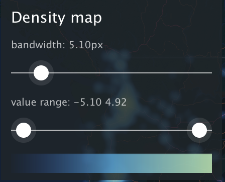
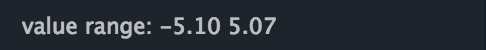
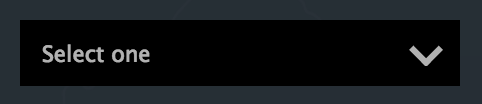
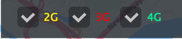
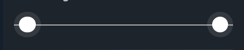
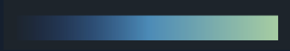

# Basic UI for Lenses

This UI Components are extension of [HERE Maps API Controls](https://developer.here.com/javascript-apis/documentation/v3/maps/topics_api_nlp/h-ui-control.html) They are helpful for simple map visualizations.

## Install

Add `npm` dependency:

```
npm install --save {{tarball}}
```

## Usage

Import components you want to use

JavaScript:

```js
import Panel from 'datalens-ui/Panel';
import Label from 'datalens-ui/Label';
//... and other components
```

CSS:

```css
@import "../node_modules/datalens-ui/Panel/index.css";
@import "../node_modules/datalens-ui/Label/index.css";
/*... and other components */
```
## Controls API

### Panel

Panel which holds controls



Example

```js
const ui = H.ui.UI.createDefault(map, defaultLayers);
const panel = new Panel('Legend Title');
ui.addControl('legend', panel);
//...
panel.addChild(someControl);
//...
panel.addEventListener('change', () => {
    //one of controls was updated, process control updates
});
```

### Label

Label for Control



Example

```js
const label = new Label();
//add control to panel before setting value
panel.addChild(label);
label.setHTML('label text');
```

### Select

Menu of options allowing single selection



Example

```js
const select = new Select({
    'value1': 'label one',
    'value2': 'label two'
});
panel.addChild(label);
//...
console.log(`value is ${select.getValue()}`);
```

### Multi-select

Check boxes allowing multiple option selection



Example

```js
const select = new Multiselect({
    'value1': 'label one',
    'value2': 'label two'
});
panel.addChild(label);
//...
select.getValue();//outputs array
```

### Slider

Range slider


Example

```js
const slider = new Slider(10); // init value from 0..100
panel.addChild(slider);
//...
console.log(select.getValue()); // outputs number
```

### Range

Slider with two handles



Example

```js
const slider = new Range([10, 90]); // init values from 0..100
panel.addChild(slider);
//...
console.log(select.getValue()); // outputs array of 2 numbers
```

### ColorLegend

Color Legend Control



Example

```js
const colorScale = d3.scaleLinear().range(['red', 'green']);
const colorLegend = new ColorLegend(colorScale);
panel.addChild(colorLegend);
colorLegend.setLables([0, 0.5, 1]); //legend labels
```

## Release (for contributors)

To release new version type in console:

```
npm version <major | minor | patch>
npm push origin HEAD --tags
```

Then [Jenkins Job](https://ci.gi.solo-experiments.com/view/JS%20API%20Dev/job/Lenses%20DL%20CLI%20Publish/) should do the rest.

